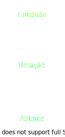
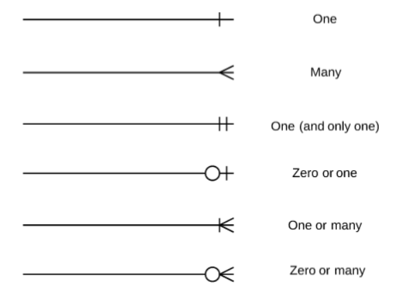

# Bases de Dados
## Níveis
1. **Conceptual** - Modelo **E-R**

    | --- Normalização

    v

2. **Lógico** - Modelo **Relacional** (derivado do E-R)
3. **Físico** - **SQL**

## Notação
 E-R | Relacional
-----|------------
 | 

## Modelo Relacional

1. Cada entidade -> Tabela

2. Cada relação N:N -> Tabela

3. Chaves estrangeiras ficam do lado do N (1:N)

## Linguagem SQL
- SELECT
- FROM
- WHERE
- GROUP BY
*deve ter todos os atributos do SELECT exceto os operadores de conjuntos*
- HAVING
- ORDER BY

### Operadores de conjuntos
- **AVG** 
- **COUNT** 
- **MAX**
- **MIN**

*i.e* SELECT * FROM aluno WHERE idade = MIN(SELECT idade FROM aluno) *retorna aluno mais novo da tabela*

- **SUM**
- **ALL**

*i.e* SELECT * FROM aluno WHERE idade <= ALL(SELECT idade FROM aluno) *retorna aluno mais novo da tabela*
- **ANY**
- **IN**
- **INTERSECT** 

### Subqueries
- Podem retornar **múltiplas linhas** - operador de conjuntos IN, ANY, ...
- Podem ser **correlacionadas** - o SELECT interno é executado a cada linha do SELECT externo
